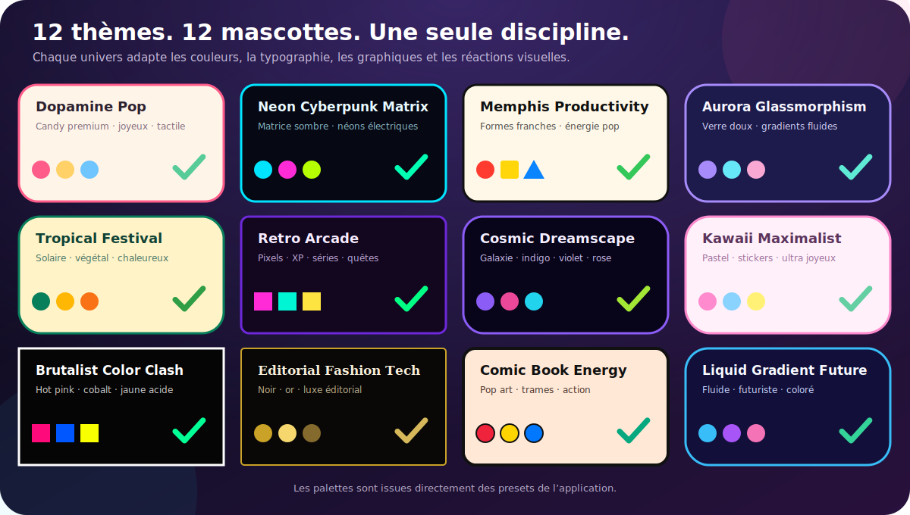
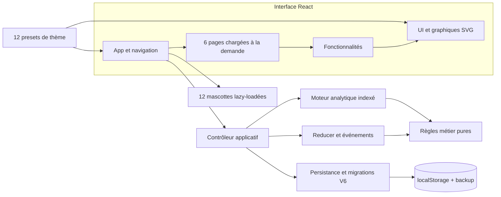

<div align="center">
  

  <h1>Discipline Dashboard</h1>

  <p><strong>Le tracker d’habitudes local, vivant et honnête.</strong></p>
  <p>Transforme tes routines en progrès visibles, sans compte, sans serveur et sans sacrifier ta vie privée.</p>

  <p>
    <a href="https://christolosier-ship-it.github.io/Tracker-Habit/">
      
    </a>
    <a href="https://github.com/christolosier-ship-it/Tracker-Habit/actions/workflows/deploy.yml">
      
    </a>
  </p>

  <p>
    
    
    
    
  </p>
</div>

---

Discipline Dashboard est une application web responsive de suivi d’habitudes quotidiennes et hebdomadaires. Elle associe une saisie rapide, des statistiques qui distinguent réellement le vide de l’échec, douze identités visuelles et une mascotte réactive par univers.

Les données restent dans le navigateur. L’application ne possède ni compte utilisateur, ni backend, ni télémétrie : elle est utilisable immédiatement et fonctionne entièrement côté client.

<div align="center">
  
</div>

## Tout ce qu’il faut pour tenir dans la durée

| Vue | Rôle véritable |
| --- | --- |
| **Dashboard** | Synthétise le score global, le mois courant, les séries, les habitudes fortes ou fragiles et la matrice annuelle. |
| **Aujourd’hui** | Affiche uniquement les habitudes pertinentes du jour et permet de faire évoluer leur statut en un geste. |
| **Mois** | Croise habitudes et jours dans une grille mensuelle éditable, avec un affichage mobile recentré sur la date choisie. |
| **Habitudes** | Crée, modifie, suspend, réactive ou supprime les habitudes tout en préservant correctement leur historique. |
| **Statistiques** | Explore les tendances mensuelles, catégories, statuts et indicateurs anti-procrastination avec des graphiques SVG natifs. |
| **Paramètres** | Choisit le thème et la mascotte, règle le traitement des non-saisis et gère l’import/export des données. |

### Une mesure qui ne triche pas

Chaque saisie suit le même cycle métier :

```text
Non saisi  →  Accompli  →  Partiel  →  Manqué  →  Repos  →  Non saisi
```

| Statut | Symbole | Valeur dans les scores |
| --- | :---: | :---: |
| Non saisi | `·` | Ignoré, ou compté comme manqué selon le réglage |
| Accompli | `✓` | 100 % |
| Partiel | `◐` | 50 % |
| Manqué | `×` | 0 % |
| Repos | `Ⅱ` | Neutre |

Les habitudes quotidiennes sont évaluées date par date. Les habitudes hebdomadaires sont agrégées sur leur semaine ISO, sans gonfler artificiellement le nombre d’occasions. Les dates futures et les périodes d’inactivité restent hors calcul.

### Une interface qui a de la personnalité

- **12 thèmes complets** : palette, typographie, surfaces, graphiques et effets sont pilotés par les mêmes tokens.
- **12 mascottes animées** : une créature propre à chaque thème, chargée à la demande et sensible à l’heure, au score et aux réussites.
- **Des réactions utiles** : journée parfaite, nouveau record de série et habitude accomplie déclenchent des retours visuels ciblés.
- **Une expérience responsive** : navigation, cartes, matrices et formulaires sont adaptés aux grands écrans comme aux mobiles.
- **Le mouvement reste optionnel** : les préférences système de réduction des animations sont respectées.

## Architecture

Le projet sépare l’interface, l’orchestration, les règles métier, les calculs et le stockage. Le composant racine assemble ces briques ; il ne porte ni les agrégations statistiques ni les mutations de données.



### Responsabilités des couches

| Couche | Responsabilité |
| --- | --- |
| `src/app` | Monte l’application, orchestre les commandes, centralise les transitions d’état et traduit les accomplissements en événements visuels. |
| `src/domain` | Définit les statuts, catégories, fréquences et règles d’évaluation sans dépendre de React. |
| `src/analytics` | Construit un index des journaux puis expose les agrégations jour, mois, année, série et anti-procrastination. |
| `src/pages` | Compose les six écrans et ne reçoit que les contrats nécessaires à chacun. |
| `src/features` | Regroupe les blocs fonctionnels : saisie, statistiques, dashboard, réglages, périodes et mascottes. |
| `src/components` | Fournit l’UI réutilisable, l’identité thématique et les graphiques SVG natifs. |
| `src/persistence` | Valide, migre, sauvegarde, restaure et remplace les données sérialisées au schéma V6. |
| `src/themes` | Déclare les tokens et comportements visuels des douze univers à partir d’un contrat commun. |

Le moteur analytique et le reducer restent testables sans DOM. Les pages et les mascottes sont séparées en chunks afin de limiter le JavaScript chargé au démarrage. Les scripts du dépôt interdisent aussi les cycles, les dépendances de couches non autorisées et le retour d’anciens monolithes.

## Stack technique

| Outil | Usage |
| --- | --- |
| [React](https://react.dev/) 18 | Interface, composition et chargement différé des écrans |
| [TypeScript](https://www.typescriptlang.org/) 6 | Contrats stricts entre domaine, application et présentation |
| [Vite](https://vite.dev/) 8 | Développement, découpage des chunks et build de production |
| [Vitest](https://vitest.dev/) 4 | Tests unitaires, couverture et garde-fou de performance |
| [GSAP](https://gsap.com/) | Animations et réactions des mascottes |
| [Lucide](https://lucide.dev/) | Icônes de l’interface |
| SVG natif | Aires, barres, anneaux, donuts et graphiques cartésiens sans bibliothèque de charting |

## Lancer le projet

### Prérequis

- [Node.js](https://nodejs.org/) 22 recommandé ;
- npm, fourni avec Node.js.

### Installation

```bash
git clone https://github.com/christolosier-ship-it/Tracker-Habit.git
cd Tracker-Habit
npm ci
npm run dev
```

Vite affiche ensuite l’adresse locale de l’application. Le dépôt contient déjà un jeu de démonstration généré au premier lancement ; aucune configuration ni clé d’API n’est nécessaire.

## Commandes utiles

| Commande | Effet |
| --- | --- |
| `npm run dev` | Démarre le serveur de développement accessible sur le réseau local. |
| `npm run test:unit` | Exécute les tests unitaires hors benchmark analytique. |
| `npm run test:performance` | Vérifie isolément le budget de performance du moteur analytique. |
| `npm run test:coverage` | Exécute la suite avec la couverture V8. |
| `npm run lint` | Contrôle les règles ESLint et React. |
| `npm run build` | Vérifie TypeScript, produit le bundle et contrôle son budget. |
| `npm run preview` | Sert localement le build de production. |
| `npm run check` | Lance en une passe l’architecture, le CSS, les cycles, le code mort, le lint, les tests, la couverture, la performance et le build. |

## Données et confidentialité

- Le stockage principal utilise `localStorage` sous la clé `discipline-dashboard-v2`.
- Avant chaque nouvelle écriture, la version précédente est conservée dans une clé de secours.
- Les imports JSON sont validés puis migrés vers le **schéma V6** avant d’entrer dans l’état applicatif.
- L’export JSON permet de sauvegarder ou transférer manuellement l’ensemble des habitudes, journaux et réglages.
- Aucun événement d’usage ni contenu personnel n’est envoyé à un service distant.

> Effacer les données du site dans le navigateur supprime aussi le suivi local. Pense à exporter régulièrement un fichier JSON si cet historique est important.

## Qualité et livraison

Chaque pull request vers `main` déclenche la chaîne complète de contrôles, puis un test de fumée dans un navigateur réel. Une fois fusionnée, la même GitHub Action construit et publie automatiquement l’application sur GitHub Pages.

Le projet assume volontairement un périmètre **local-first** : pas de compte, pas de synchronisation cloud, pas de backend et pas de notification distante. Ce choix garde l’application rapide, portable et indépendante d’un service tiers.

---

<div align="center">
  <strong>Construis une discipline visible, un jour à la fois.</strong>
  <br /><br />
  <a href="https://christolosier-ship-it.github.io/Tracker-Habit/">Essayer Discipline Dashboard</a>
  ·
  <a href="https://github.com/christolosier-ship-it/Tracker-Habit/issues">Signaler un problème</a>
</div>
